 # Sentellent: Contextual Agentic AI Indian Stock Analyst

### Enterprise-Grade Multi-Agent Financial Intelligence Platform powered by Retrieval-Augmented Generation (RAG), LangGraph, Google Gemini, FastAPI, Next.js, PostgreSQL, Docker, Terraform, and AWS.

---

[]()
[]()
[]()
[]()
[]()
[]()
[]()
[]()
[]()
[]()
[]()
[]()
[]()

</div>

---

# Sentellent Alpha

Sentellent Alpha is an **AI-powered Multi-Agent Stock Market Intelligence Platform** designed to combine deterministic financial analytics, Retrieval-Augmented Generation (RAG), personalized investor memory, and autonomous reasoning into a unified investment research platform.

Unlike traditional stock screeners, Sentellent Alpha combines **structured financial data**, **real-time market information**, **vector-based knowledge retrieval**, and **LLM-powered reasoning** to generate explainable investment recommendations.

The platform enables investors to:

-  Analyze company fundamentals
-  Interact with AI research agents
-  Retrieve financial news using vector search
-  Search SEC reports and company documents
-  Track personalized watchlists
-  Build long-term investor memory
-  Receive deterministic stock recommendations
-  Explore financial ratios with interactive dashboards
-  Deploy the complete infrastructure on AWS

---

#  Live Demo

## Live Application URL

> [https://sentellent-stock-analyst-pi.vercel.app](https://sentellent-stock-analyst-pi.vercel.app)

## Backend API

> [http://sentellent-production-alb-2068419761.ap-south-1.elb.amazonaws.com/docs](http://sentellent-production-alb-2068419761.ap-south-1.elb.amazonaws.com/health/docs)

## Health Endpoint

> [http://sentellent-production-alb-2068419761.ap-south-1.elb.amazonaws.com/health](http://sentellent-production-alb-2068419761.ap-south-1.elb.amazonaws.com/health/health)

---

#  Key Highlights

✔ Enterprise-grade Full Stack Architecture

✔ LangGraph Multi-Agent AI Workflow

✔ Retrieval-Augmented Generation (RAG)

✔ Google Gemini 2.5 Flash Integration

✔ PostgreSQL + pgvector Knowledge Base

✔ Personalized Investor Memory

✔ AI Portfolio Recommendation Engine

✔ Deterministic Financial Scoring Engine

✔ Google OAuth Authentication

✔ AWS Production Deployment

✔ Infrastructure as Code using Terraform

✔ Automated CI/CD using GitHub Actions

✔ Dockerized Backend & Frontend

✔ RESTful FastAPI Backend

✔ Modern Next.js 15 Frontend

✔ Responsive Enterprise Dashboard

✔ Scalable Cloud-native Architecture

---

#  Core Features

##  AI Research Workspace

Conduct conversational financial research powered by LangGraph multi-agent workflows.

Features include:

- Planner Agent
- Financial Screener Agent
- Retrieval Agent
- Memory Agent
- Synthesis Agent
- Live Company Analysis
- Executive Financial Summary
- Explainable Responses
- Source-backed Citations

---

##  Market Screener

Analyze listed companies using deterministic financial metrics.

Supported metrics include:

- PE Ratio
- PB Ratio
- Debt to Equity
- ROE
- ROCE
- Dividend Yield
- Beta
- Market Capitalization
- AI Weighted Score
- Deterministic Buy/Sell Recommendation

---

##  Knowledge Hub

Semantic search across financial knowledge.

Supports:

- Vector Search
- Company Reports
- Earnings Reports
- News Articles
- Financial Documents
- Embedded Knowledge Chunks
- Source Verification

---

##  Portfolio Intelligence

Personalized investment workspace.

Includes:

- Watchlist Management
- Portfolio Analytics
- Investor Profile
- AI Stock Recommendations
- Portfolio Health Score
- Buy Signals
- Long-term Memory

---

##  Market Analytics

Interactive dashboards for:

- Sector Distribution
- News Coverage
- Market Sentiment
- Financial Ratios
- Trend Analysis
- Executive Insights

---

##  Investor Memory

Persistent investor profiling using AI.

Stores:

- Risk Appetite
- Investment Horizon
- Preferred Sectors
- Avoided Sectors
- Historical Preferences
- AI Context Memory

---

##  Authentication

Secure login powered by:

- Google OAuth
- JWT Authentication
- Protected Routes
- Demo Evaluator Access

---

##  Cloud Infrastructure

Production deployment includes:

- AWS ECS Fargate
- Amazon RDS PostgreSQL
- Amazon ECR
- Amazon CloudWatch
- Terraform Infrastructure
- GitHub Actions CI/CD
- Docker Containers
- Vercel Frontend

---

#  Table of Contents

- [Project Overview](#-sentellent-alpha)
- [Live Demo](#-live-demo)
- [Features](#-core-features)
- [System Architecture](#-system-architecture)
- [Technology Stack](#-technology-stack)
- [Project Structure](#-project-directory-structure)
- [Installation](#-installation)
- [Environment Variables](#-environment-variables)
- [Running Locally](#-running-locally)
- [Docker Deployment](#-docker-deployment)
- [AWS Deployment](#-aws-deployment-architecture)
- [CI/CD Pipeline](#-cicd-pipeline)
- [API Documentation](#-api-documentation)
- [AI Pipeline](#-ai-workflow)
- [Database Schema](#-database-schema)
- [User Interface](#-screenshots)
- [Deployment Screenshots](#-deployment)
- [Future Improvements](#-future-improvements)
- [Contributors](#-contributors)
- [License](#-license)

---

#  Platform Preview

> The following screenshots demonstrate the major modules of Sentellent Alpha.

<p align="center">
  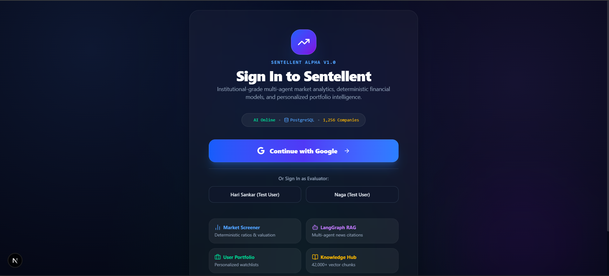
</p>

### Dashboard Overview

The Dashboard Overview serves as the central command center of Sentellent Alpha.

It provides:

- Live market overview
- Portfolio health
- AI recommendation score
- PostgreSQL status
- LangGraph status
- Market intelligence
- Watchlist summary
- AI latency metrics

**Technology Used**

- Next.js 15
- TailwindCSS
- FastAPI
- PostgreSQL
- LangGraph
- Google Gemini
- Yahoo Finance

---


#  System Architecture

Sentellent Alpha follows a cloud-native, microservice-inspired architecture where the frontend, backend, AI services, and infrastructure are completely decoupled.

The application combines deterministic financial analytics with Retrieval-Augmented Generation (RAG) and multi-agent reasoning to provide explainable stock intelligence.

---

## Overall Architecture

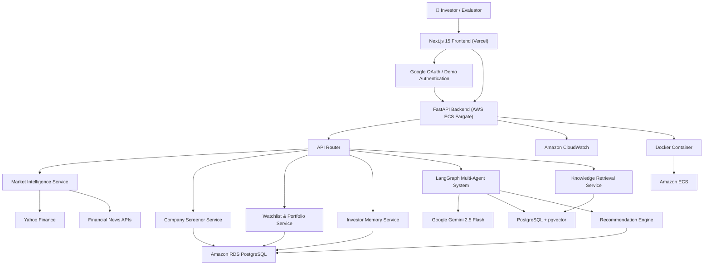
```mermaid
flowchart TD

    User["👤 Investor / Evaluator"]

    User --> Frontend

    Frontend["Next.js 15 Frontend (Vercel)"]

    Frontend --> OAuth["Google OAuth / Demo Authentication"]

    OAuth --> Backend

    Frontend --> Backend["FastAPI Backend (AWS ECS Fargate)"]

    Backend --> Router["API Router"]

    Router --> Market["Market Intelligence Service"]
    Router --> Company["Company Screener Service"]
    Router --> Portfolio["Watchlist & Portfolio Service"]
    Router --> Memory["Investor Memory Service"]
    Router --> Agent["LangGraph Multi-Agent System"]
    Router --> Retrieval["Knowledge Retrieval Service"]

    Market --> Yahoo["Yahoo Finance"]
    Market --> News["Financial News APIs"]

    Company --> PostgreSQL

    Portfolio --> PostgreSQL

    Memory --> PostgreSQL

    Retrieval --> PGVector

    Agent --> Gemini["Google Gemini 2.5 Flash"]

    Agent --> PGVector

    Agent --> Recommendation["Recommendation Engine"]

    Recommendation --> PostgreSQL

    PGVector["PostgreSQL + pgvector"]

    PostgreSQL["Amazon RDS PostgreSQL"]

    Backend --> CloudWatch["Amazon CloudWatch"]

    Backend --> Docker["Docker Container"]

    Docker --> ECS["Amazon ECS"]

```

---

#  AWS Production Architecture

The production environment is completely hosted on AWS using Infrastructure-as-Code powered by Terraform.

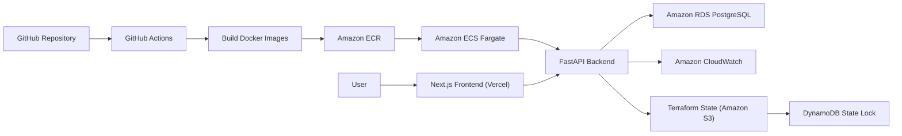
```mermaid
flowchart LR

GitHub["GitHub Repository"]

GitHub --> Actions["GitHub Actions"]

Actions --> Build["Build Docker Images"]

Build --> ECR["Amazon ECR"]

ECR --> ECS["Amazon ECS Fargate"]

ECS --> Backend["FastAPI Backend"]

Backend --> RDS["Amazon RDS PostgreSQL"]

Backend --> CW["Amazon CloudWatch"]

Backend --> S3["Terraform State (Amazon S3)"]

S3 --> Dynamo["DynamoDB State Lock"]

User --> Vercel["Next.js Frontend (Vercel)"]

Vercel --> Backend

```

---

#  AI Multi-Agent Workflow

Unlike conventional chatbot applications, Sentellent Alpha employs multiple specialized AI agents orchestrated using LangGraph.

Each user request is decomposed into multiple reasoning stages before producing the final response.

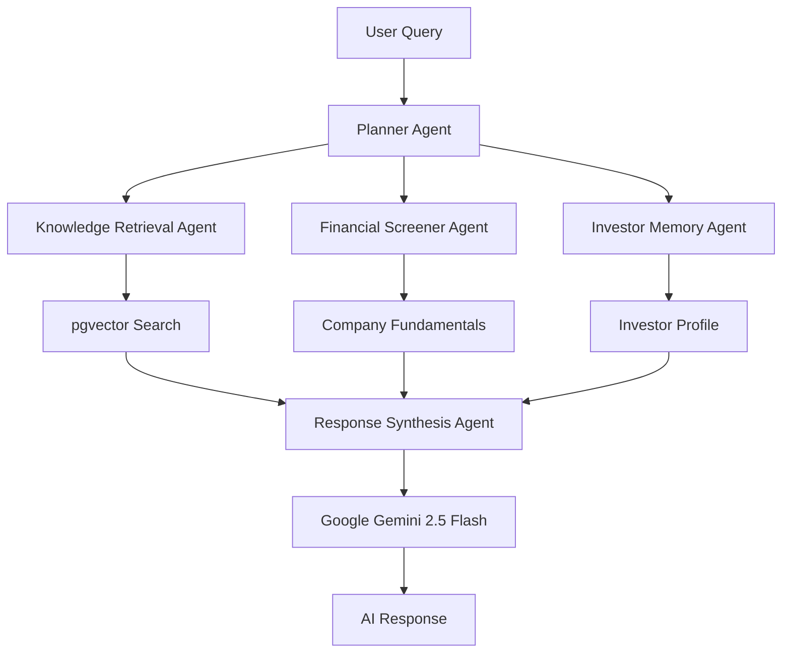
```mermaid
flowchart TD

User["User Query"]

User --> Planner

Planner["Planner Agent"]

Planner --> Screener

Planner --> Retrieval

Planner --> Memory

Screener["Financial Screener Agent"]

Retrieval["Knowledge Retrieval Agent"]

Memory["Investor Memory Agent"]

Retrieval --> PG["pgvector Search"]

Memory --> DB["Investor Profile"]

Screener --> Fundamentals["Company Fundamentals"]

PG --> Synthesis

Fundamentals --> Synthesis

DB --> Synthesis

Synthesis["Response Synthesis Agent"]

Synthesis --> Gemini

Gemini["Google Gemini 2.5 Flash"]

Gemini --> Response["AI Response"]

```

---

#  Request Lifecycle

Every request passes through multiple backend services before the final response reaches the frontend.

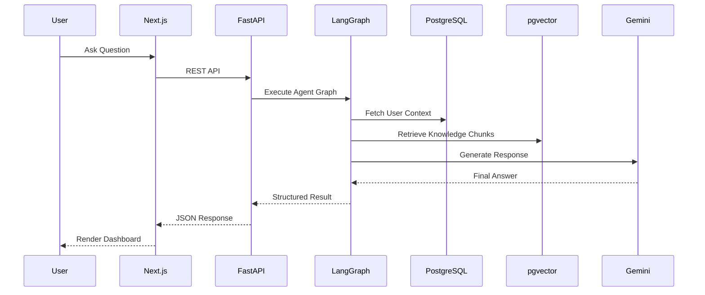
```mermaid
sequenceDiagram

participant U as User

participant FE as Next.js

participant API as FastAPI

participant LG as LangGraph

participant DB as PostgreSQL

participant PG as pgvector

participant LLM as Gemini

U->>FE: Ask Question

FE->>API: REST API

API->>LG: Execute Agent Graph

LG->>DB: Fetch User Context

LG->>PG: Retrieve Knowledge Chunks

LG->>LLM: Generate Response

LLM-->>LG: Final Answer

LG-->>API: Structured Result

API-->>FE: JSON Response

FE-->>U: Render Dashboard

```

---

#  Technology Stack

The project is built using a modern cloud-native technology stack.

| Layer | Technology |
|---------|------------|
| Frontend | Next.js 15 |
| UI Framework | React 19 |
| Styling | TailwindCSS |
| Components | shadcn/ui |
| Backend | FastAPI |
| Authentication | Google OAuth + Demo Authentication |
| AI Framework | LangGraph |
| LLM | Google Gemini 2.5 Flash |
| Vector Database | pgvector |
| Database | PostgreSQL 17 |
| ORM | SQLAlchemy |
| Validation | Pydantic |
| Containerization | Docker |
| Infrastructure | Terraform |
| Cloud Provider | AWS |
| Compute | Amazon ECS Fargate |
| Container Registry | Amazon ECR |
| Database Hosting | Amazon RDS |
| Logging | Amazon CloudWatch |
| CI/CD | GitHub Actions |
| Frontend Hosting | Vercel |
| Financial Data | Yahoo Finance |
| News Intelligence | RSS + Financial News APIs |

---

#  Core AI Technologies

Sentellent Alpha integrates multiple AI technologies to provide explainable market intelligence.

## LangGraph

Responsible for:

- Multi-Agent Orchestration
- State Management
- Conditional Routing
- Tool Execution
- Memory Injection

---

## Google Gemini 2.5 Flash

Provides:

- Financial reasoning
- Executive summaries
- Investment explanations
- Recommendation synthesis
- Conversational intelligence

---

## PostgreSQL + pgvector

Stores:

- Knowledge embeddings
- Financial news chunks
- SEC reports
- Company filings
- Similarity search vectors

---

## Deterministic Recommendation Engine

Unlike purely LLM-based recommendations, Sentellent Alpha combines deterministic financial scoring with AI reasoning.

Signals include:

- PE Ratio
- ROE
- Debt/Equity
- Market Cap
- Dividend Yield
- Beta
- Sentiment
- Investor Profile
- Portfolio Match

This produces an explainable weighted investment score instead of relying solely on language model outputs.

---

#  Security Architecture

The platform follows secure authentication and authorization practices.

### Authentication

- Google OAuth 2.0
- JWT Session Tokens
- Protected Routes
- Server-side Session Validation
- One-click Demo Evaluator Login

---

### Infrastructure Security

- Private Amazon RDS
- ECS Security Groups
- IAM Roles
- Environment Variables
- HTTPS Everywhere
- CloudWatch Monitoring

---

#  Scalability Highlights

Designed to support enterprise-scale deployment.

✔ Stateless FastAPI Services

✔ Containerized Architecture

✔ Horizontal ECS Scaling

✔ Infrastructure as Code

✔ Independent Frontend Deployment

✔ Separate AI Layer

✔ Decoupled Database

✔ Modular Business Services

✔ Vector Database Integration

✔ Cloud-native Deployment Pipeline

---

#  Project Directory Structure

Sentellent Alpha follows a modular architecture that separates the frontend, backend, infrastructure, AI pipeline, and deployment logic into well-defined directories.

```text
sentellent-stock-analyst/
│
├── .github/                  # GitHub Actions CI/CD Workflows
├── backend/                  # FastAPI Backend
├── frontend/                 # Next.js 15 Frontend
├── terraform/                # AWS Infrastructure as Code
├── docker-compose.yml        # Local Multi-container Environment
└── README.md
```

The complete directory hierarchy is shown below.

> **Note:** The following structure represents the production-ready organization of the project.

```text
sentellent-stock-analyst/
├── .github/
│   └── workflows/
│       ├── deploy-backend.yml
│       └── deploy-frontend.yml
│
├── backend/
│   ├── alembic/
│   ├── app/
│   ├── data/
│   ├── tests/
│   ├── Dockerfile
│   ├── entrypoint.sh
│   ├── requirements.txt
│   └── pyproject.toml
│
├── frontend/
│   ├── app/
│   ├── components/
│   ├── services/
│   ├── Dockerfile
│   ├── middleware.ts
│   ├── auth.ts
│   └── package.json
│
├── terraform/
│   ├── bootstrap/
│   ├── modules/
│   ├── provider.tf
│   ├── variables.tf
│   ├── outputs.tf
│   └── main.tf
│
├── docker-compose.yml
└── README.md
```

---

#  Repository Overview

The project is organized into four major components.

| Folder | Description |
|---------|-------------|
| `.github/` | GitHub Actions workflows for CI/CD |
| `backend/` | FastAPI application, AI engine, database services |
| `frontend/` | Next.js dashboard and authentication |
| `terraform/` | Complete AWS Infrastructure as Code |
| `docker-compose.yml` | Local development environment |

---

#  Backend Architecture

The backend is responsible for all business logic, AI orchestration, database access, financial analysis, authentication, and data ingestion.

```
backend
│
├── FastAPI REST APIs
├── LangGraph Multi-Agent System
├── Company Screener
├── Recommendation Engine
├── RAG Knowledge Base
├── PostgreSQL Models
├── Investor Memory
├── Yahoo Finance Integration
├── News Ingestion
├── Google Gemini
├── Alembic Migrations
└── Pytest Suite
```

### Backend Highlights

- FastAPI REST APIs
- SQLAlchemy ORM
- PostgreSQL Database
- pgvector Integration
- LangGraph Multi-Agent Workflow
- Google Gemini
- Automated Financial Data Ingestion
- RESTful Service Layer
- JWT Authentication
- Google OAuth Verification

---

#  Frontend Architecture

The frontend is built using the latest Next.js App Router architecture.

```
frontend
│
├── Dashboard
├── Login
├── Portfolio
├── Knowledge Hub
├── Research Workspace
├── Analytics
├── Activity History
├── Investor Preferences
└── Authentication
```

### Frontend Features

- Next.js 15
- React 19
- TailwindCSS
- shadcn/ui
- NextAuth.js
- Google OAuth
- Demo User Authentication
- Responsive Dashboard
- Dark Enterprise Theme

---

#  AI Components

The AI layer is completely modular.

```
AI Layer

Planner Agent

↓

Financial Screener Agent

↓

Knowledge Retrieval Agent

↓

Investor Memory Agent

↓

Recommendation Engine

↓

Google Gemini

↓

Final Response
```

Each component can evolve independently without affecting the remaining workflow.

---

#  Database Design

The PostgreSQL database stores all structured application data.

Major tables include:

| Table | Purpose |
|--------|---------|
| users | Registered users |
| companies | Master company information |
| company_fundamentals | Financial metrics |
| watchlists | User portfolio |
| investor_memory | Personalized AI memory |
| knowledge_documents | Financial documents |
| document_embeddings | pgvector embeddings |
| chat_sessions | Conversation sessions |
| chat_messages | User & AI conversations |

---

#  Environment Variables

Create the following files before running the application.

## Backend

Create

```
backend/.env
```

Example

```env
DATABASE_URL=

GOOGLE_API_KEY=

OPENROUTER_API_KEY=

GOOGLE_CLIENT_ID=

GOOGLE_CLIENT_SECRET=

JWT_SECRET_KEY=

AWS_REGION=

AWS_ACCESS_KEY_ID=

AWS_SECRET_ACCESS_KEY=
```

---

## Frontend

Create

```
frontend/.env.local
```

Example

```env
NEXTAUTH_URL=

NEXTAUTH_SECRET=

GOOGLE_CLIENT_ID=

GOOGLE_CLIENT_SECRET=

NEXT_PUBLIC_BACKEND_URL=
```

---

#  Running Locally

## Clone Repository

```bash
git clone https://github.com/your-username/sentellent-stock-analyst.git

cd sentellent-stock-analyst
```

---

## Backend Setup

```bash
cd backend

python -m venv .venv

source .venv/bin/activate

pip install -r requirements.txt
```

Run migrations

```bash
alembic upgrade head
```

Seed companies

```bash
python -m app.scripts.seed_companies
```

Ingest financial fundamentals

```bash
python -m app.scripts.ingest_fundamentals
```

Run backend

```bash
uvicorn app.main:app --reload
```

---

## Frontend Setup

```bash
cd frontend

npm install

npm run dev
```

Frontend

```
http://localhost:3000
```

Backend

```
http://localhost:8000
```

Swagger API

```
http://localhost:8000/docs
```

---

#  Docker Deployment

Sentellent Alpha supports fully containerized deployment.

Start every service using Docker Compose.

```bash
docker compose up --build
```

This starts:

- PostgreSQL
- FastAPI
- Next.js
- Networking
- Volumes

---

#  Backend Startup Sequence

When the backend container starts, the following initialization pipeline is executed automatically.

```text
Container Starts

↓

Alembic Database Migration

↓

Seed Company Master Data

↓

Download Financial Fundamentals

↓

Populate PostgreSQL

↓

Launch FastAPI Server
```

The startup script (`entrypoint.sh`) ensures that a newly deployed environment is fully initialized without requiring manual database setup.

---

#  Docker Container Workflow

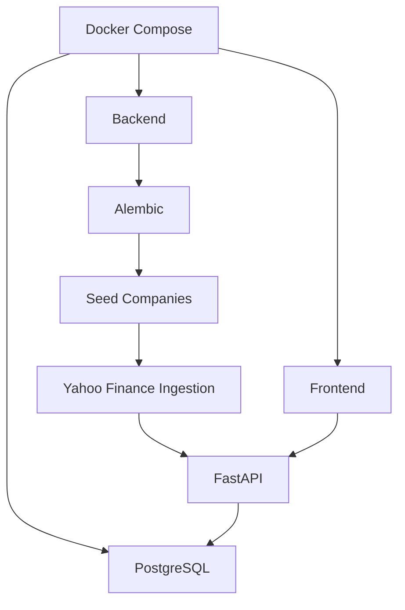
```mermaid
flowchart TD

Docker["Docker Compose"]

Docker --> PostgreSQL

Docker --> Backend

Docker --> Frontend

Backend --> Migration["Alembic"]

Migration --> Seeder["Seed Companies"]

Seeder --> Fundamentals["Yahoo Finance Ingestion"]

Fundamentals --> FastAPI

Frontend --> FastAPI

FastAPI --> PostgreSQL

```

---

#  Running Tests

The backend includes a comprehensive Pytest suite.

Run all tests:

```bash
pytest
```

Run with verbose output:

```bash
pytest -v
```

Generate coverage report:

```bash
pytest --cov=app
```

---

#  Production Readiness

The backend is production-ready with:

- Docker Multi-stage Builds
- Non-root Containers
- Automated Database Migrations
- Automatic Data Seeding
- Automatic Financial Data Ingestion
- Cloud-native Deployment
- Infrastructure as Code
- GitHub Actions Automation
- Centralized CloudWatch Logging

---

#  AWS Deployment Architecture

Sentellent Alpha is deployed using a production-grade cloud architecture on Amazon Web Services (AWS). The infrastructure is fully automated using **Terraform**, containerized using **Docker**, and continuously deployed through **GitHub Actions**.

The deployment follows cloud-native best practices, ensuring scalability, reliability, and maintainability.

---

##  Production Infrastructure

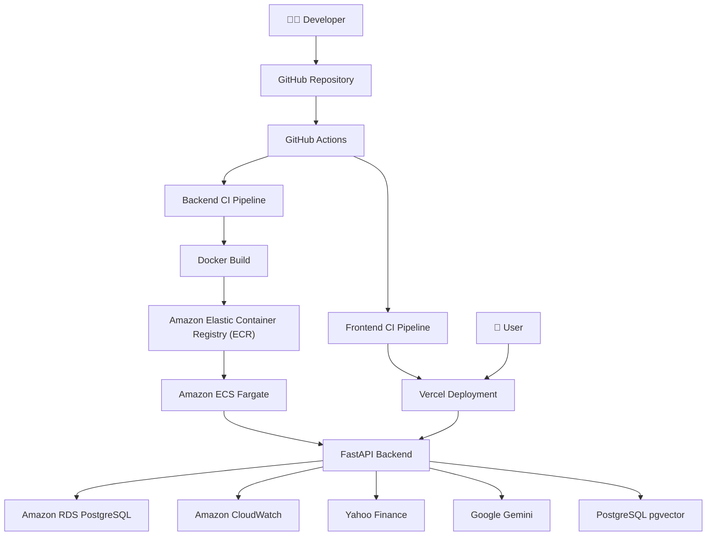
```mermaid
flowchart TD

Developer["👨‍💻 Developer"]

Developer --> GitHub["GitHub Repository"]

GitHub --> Actions["GitHub Actions"]

Actions --> BackendBuild["Backend CI Pipeline"]

Actions --> FrontendBuild["Frontend CI Pipeline"]

BackendBuild --> Docker["Docker Build"]

Docker --> ECR["Amazon Elastic Container Registry (ECR)"]

ECR --> ECS["Amazon ECS Fargate"]

ECS --> FastAPI["FastAPI Backend"]

FastAPI --> RDS["Amazon RDS PostgreSQL"]

FastAPI --> CW["Amazon CloudWatch"]

FastAPI --> Yahoo["Yahoo Finance"]

FastAPI --> Gemini["Google Gemini"]

FastAPI --> PGVector["PostgreSQL pgvector"]

FrontendBuild --> Vercel["Vercel Deployment"]

User["👤 User"] --> Vercel

Vercel --> FastAPI
```

---

#  AWS Services Used

| AWS Service | Purpose |
|-------------|----------|
| Amazon ECS Fargate | Hosts the FastAPI backend containers |
| Amazon ECR | Stores Docker container images |
| Amazon RDS PostgreSQL | Primary relational database |
| Amazon CloudWatch | Centralized logging and monitoring |
| Amazon S3 | Terraform remote state storage |
| Amazon DynamoDB | Terraform state locking |
| IAM | Secure role-based permissions |
| VPC | Network isolation |
| Security Groups | Network access control |

---

#  Infrastructure as Code (Terraform)

The complete cloud infrastructure is managed using **Terraform**, enabling reproducible deployments and version-controlled infrastructure.

### Provisioned Resources

- Virtual Private Cloud (VPC)
- Public & Private Subnets
- Internet Gateway
- Route Tables
- Security Groups
- ECS Cluster
- ECS Service
- Task Definitions
- Amazon RDS PostgreSQL
- Amazon ECR Repositories
- CloudWatch Log Groups
- IAM Roles
- S3 Backend
- DynamoDB Lock Table

This approach eliminates manual cloud configuration and ensures consistent deployments across environments.

---

#  Deployment Workflow

The deployment pipeline follows a fully automated workflow.

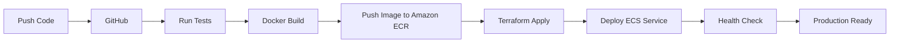
```mermaid
flowchart LR

Code["Push Code"]

Code --> GitHub

GitHub --> Tests["Run Tests"]

Tests --> Build["Docker Build"]

Build --> Push["Push Image to Amazon ECR"]

Push --> Terraform["Terraform Apply"]

Terraform --> ECS["Deploy ECS Service"]

ECS --> Health["Health Check"]

Health --> Production["Production Ready"]

```

---

#  GitHub Actions CI/CD Pipeline

The project uses **GitHub Actions** to automate testing, building, and deployment.

## Backend Pipeline

The backend workflow performs the following steps automatically whenever changes are pushed to the production branch.

1. Checkout Repository
2. Configure Python Environment
3. Install Dependencies
4. Run Pytest Test Suite
5. Build Docker Image
6. Authenticate with Amazon ECR
7. Push Docker Image
8. Execute Terraform
9. Update ECS Task Definition
10. Deploy New Backend Revision
11. Verify Deployment Health

---

## Frontend Pipeline

The frontend deployment pipeline performs:

1. Checkout Repository
2. Install Node Dependencies
3. TypeScript Validation
4. Next.js Production Build
5. Deploy to Vercel

---

#  Deployment Architecture

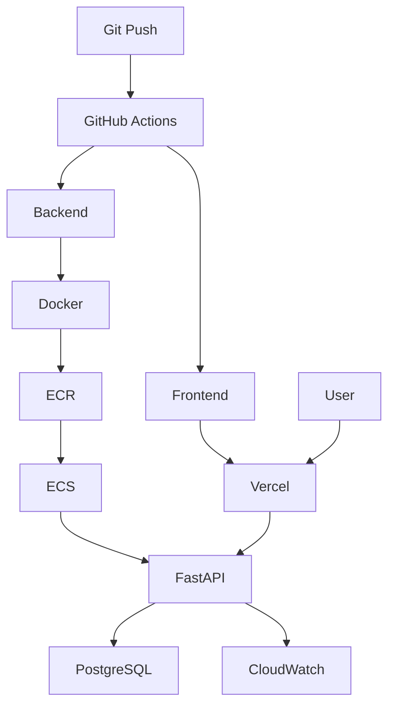
```mermaid
flowchart TD

Push["Git Push"]

Push --> Actions["GitHub Actions"]

Actions --> Backend

Actions --> Frontend

Backend --> Docker

Docker --> ECR

ECR --> ECS

ECS --> BackendAPI["FastAPI"]

BackendAPI --> PostgreSQL

BackendAPI --> CloudWatch

Frontend --> Vercel

User --> Vercel

Vercel --> BackendAPI

```

---

#  Deployment Screenshots

The following screenshots demonstrate the production deployment and cloud infrastructure used by Sentellent Alpha.

---

## Amazon ECS Cluster

<p align="center">
  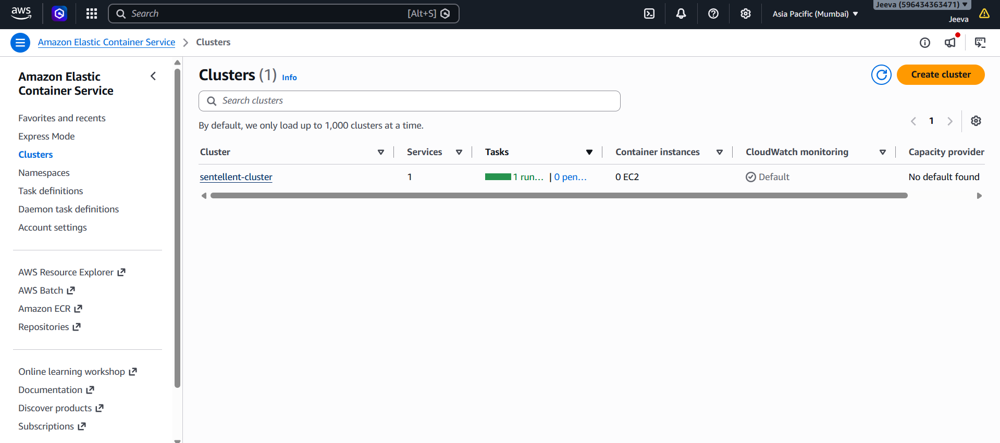
</p>

The ECS Cluster hosts the production FastAPI backend using AWS Fargate. Container orchestration is fully managed by AWS, eliminating the need to manage virtual machines.

**Technologies**

- Amazon ECS
- AWS Fargate
- Docker
- FastAPI

---

## ECS Service

<p align="center">
  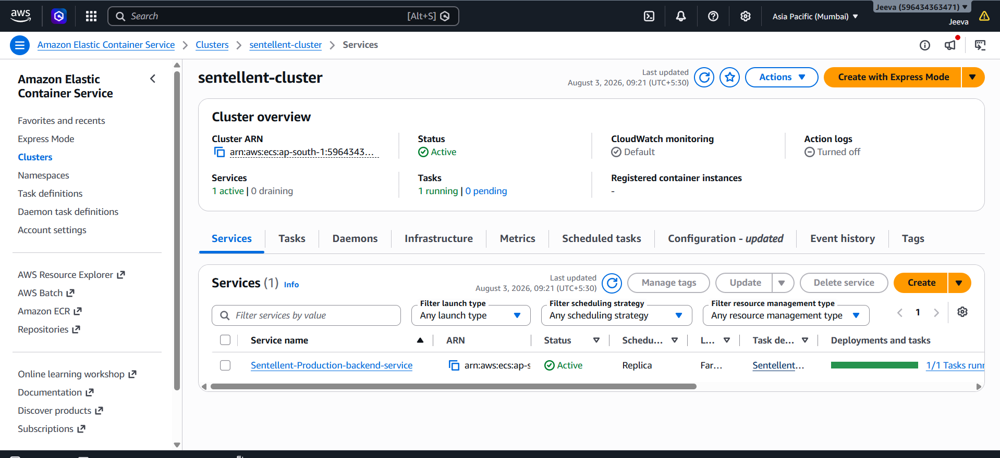
</p>

The ECS Service ensures that the required number of backend tasks remain healthy. Rolling deployments automatically replace older containers without downtime.

---

## ECS Task Definition

<p align="center">
  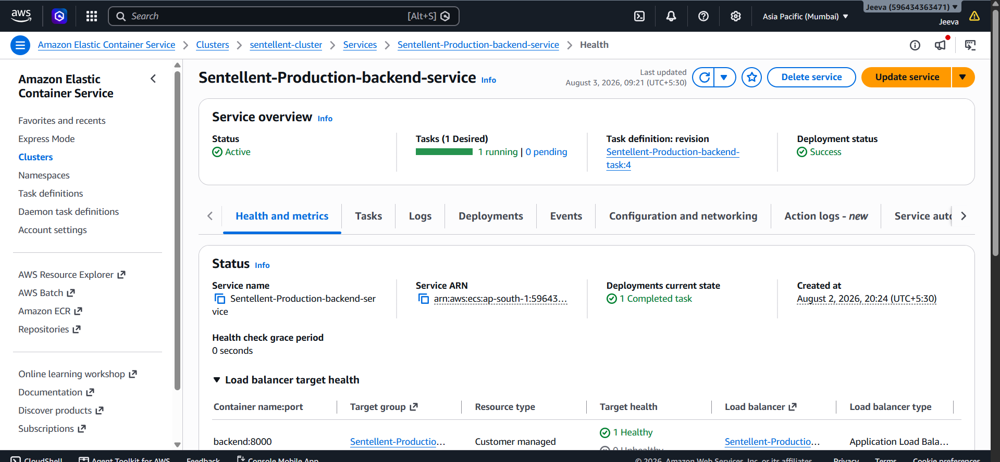
</p>

Task Definitions specify CPU, memory allocation, environment variables, networking, IAM permissions, and Docker images used by the backend service.

---

## Amazon ECR Repository

<p align="center">
  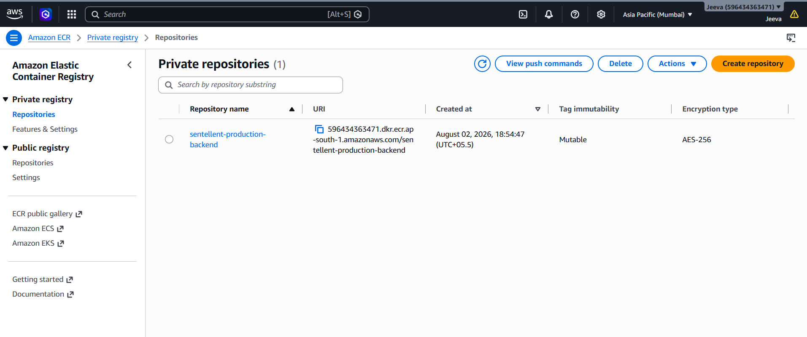
</p>

Amazon Elastic Container Registry stores versioned Docker images generated by GitHub Actions before deployment to ECS.

---

<p align="center">
  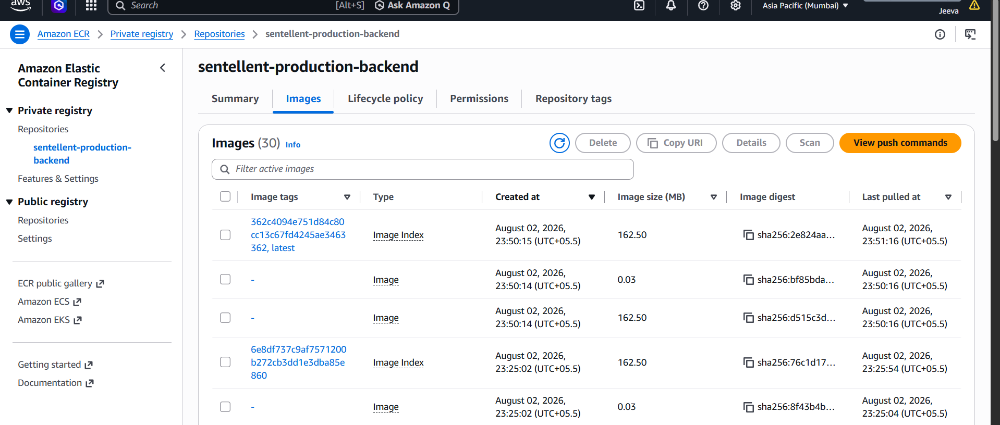
</p>

Image tags enable version tracking and rollback if required.

---

<p align="center">
  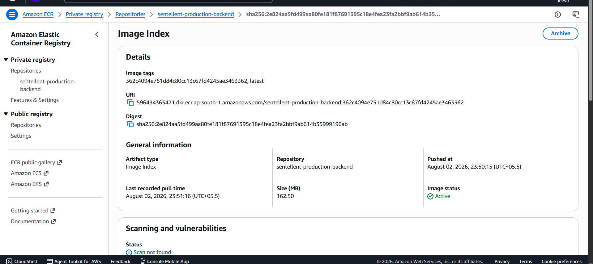
</p>

Container images are automatically updated after every successful CI/CD execution.

---

## Amazon RDS PostgreSQL

<p align="center">
  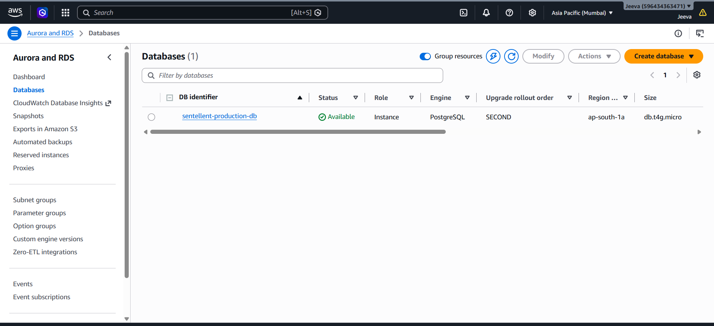
</p>

Amazon RDS hosts the PostgreSQL database containing companies, financial fundamentals, investor memory, vector embeddings, chat history, and watchlists.

---

<p align="center">
  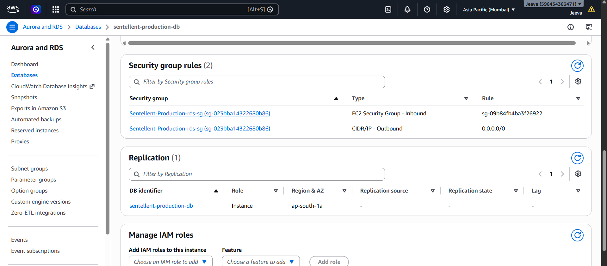
</p>

The database is deployed within a private subnet and accessed securely through ECS.

---

<p align="center">
  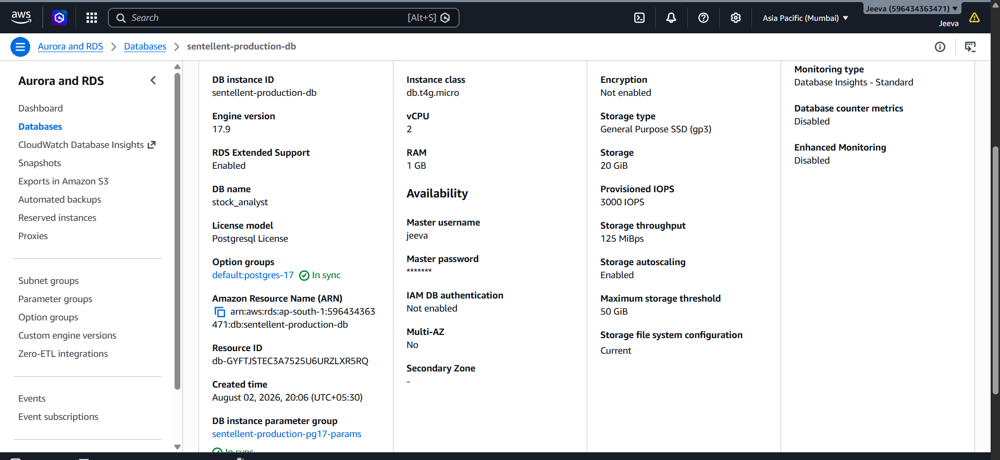
</p>

Database migrations are executed automatically during container startup using Alembic.

---

## Amazon CloudWatch

<p align="center">
  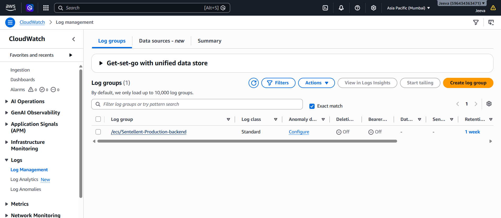
</p>

CloudWatch aggregates application logs, deployment logs, and runtime diagnostics from ECS containers.

---

<p align="center">
  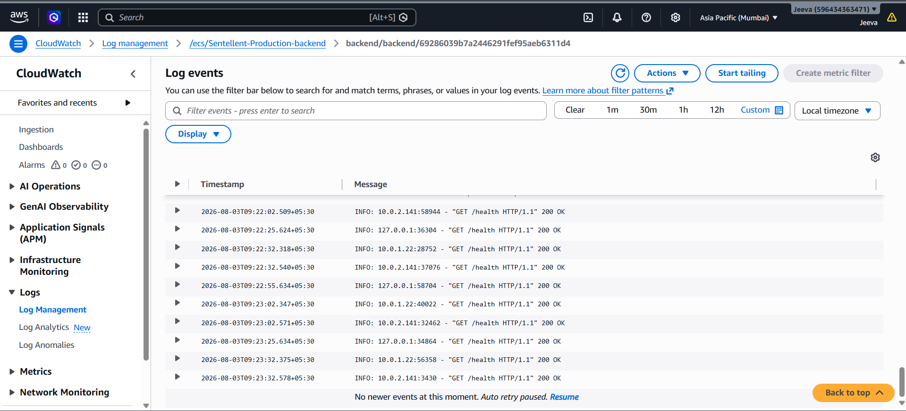
</p>

This enables centralized monitoring, troubleshooting, and health verification of production services.

---

## Amazon S3

<p align="center">
  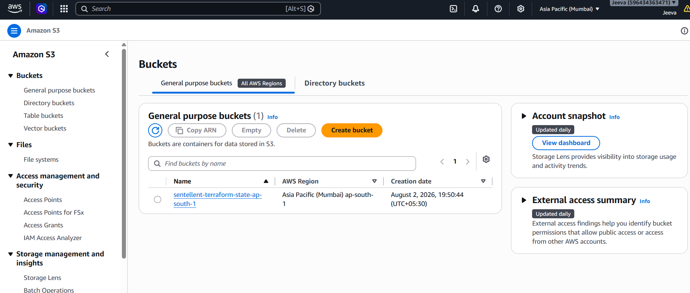
</p>

Amazon S3 stores the Terraform remote state, allowing collaborative infrastructure management.

---

<p align="center">
  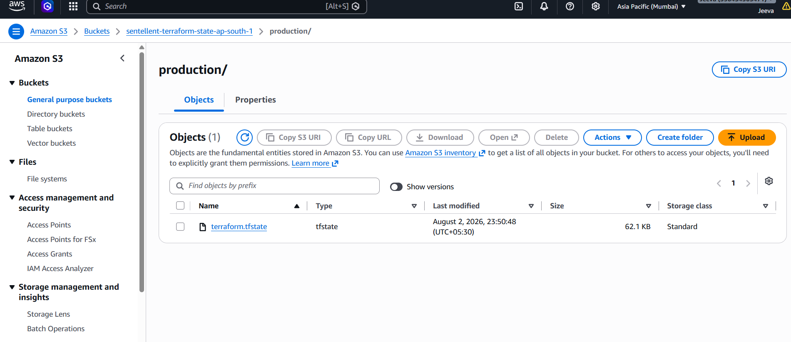
</p>

Remote state ensures infrastructure consistency across deployments.

---

## Amazon DynamoDB

<p align="center">
  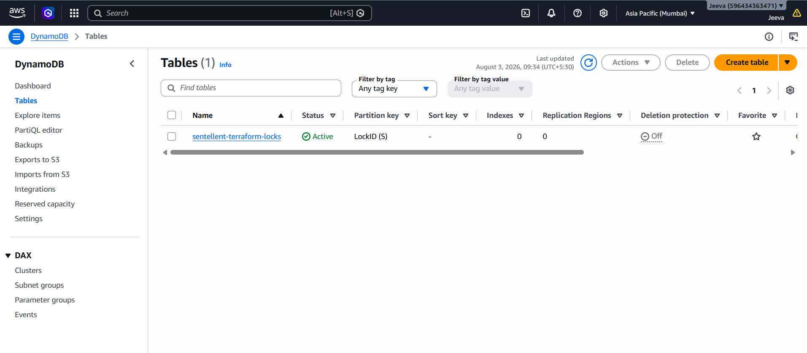
</p>

DynamoDB is used for Terraform state locking, preventing concurrent infrastructure modifications.

---

<p align="center">
  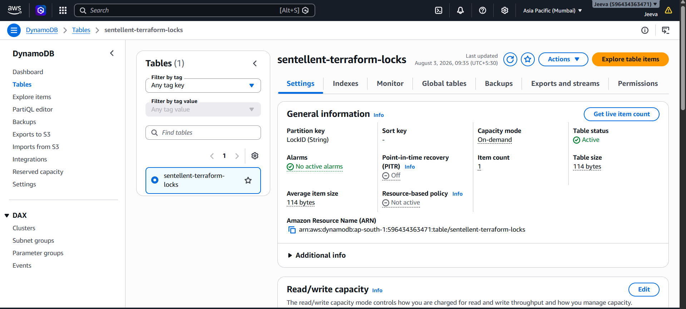
</p>

State locking guarantees safe and conflict-free infrastructure provisioning.

---

# ⚙️ GitHub Actions

The project uses two independent GitHub Actions workflows.

- Backend Deployment Pipeline
- Frontend Deployment Pipeline

---

## Backend Workflow

<p align="center">
  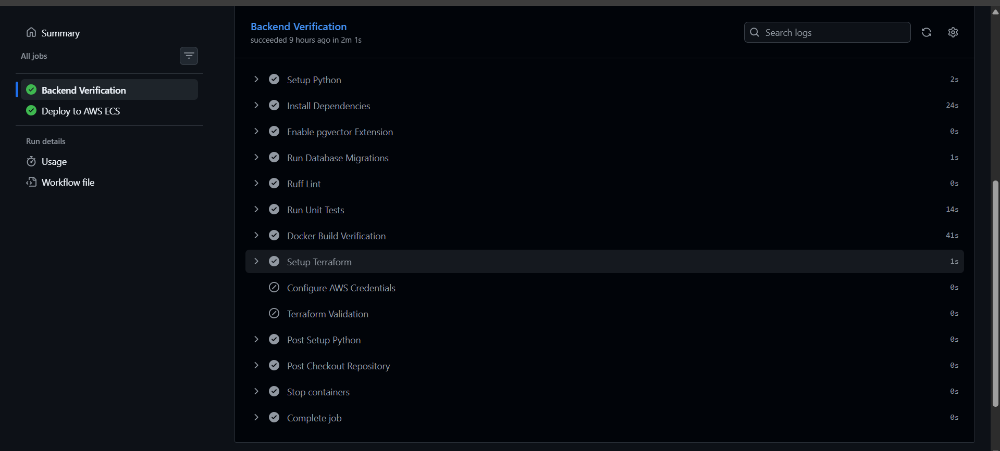
</p>

This workflow builds, tests, containerizes, and deploys the FastAPI backend to Amazon ECS.

---

<p align="center">
  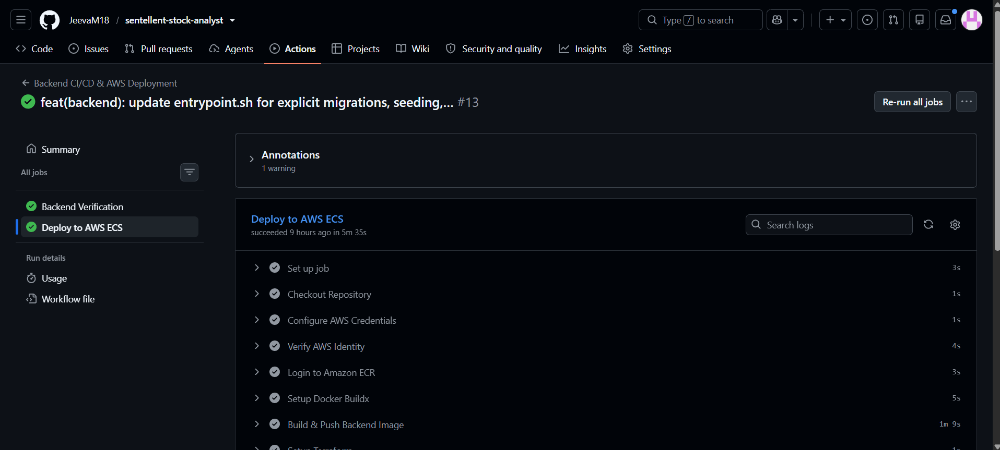
</p>

Automated deployment ensures that production always reflects the latest validated code.

---

<p align="center">
  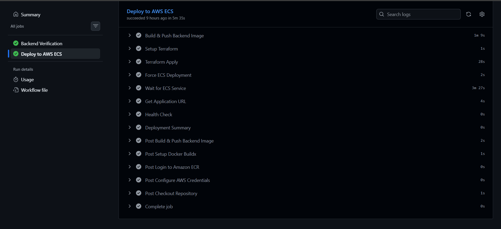
</p>

Deployment logs provide complete visibility into every CI/CD stage.

---

## GitHub Actions Dashboard

<p align="center">
  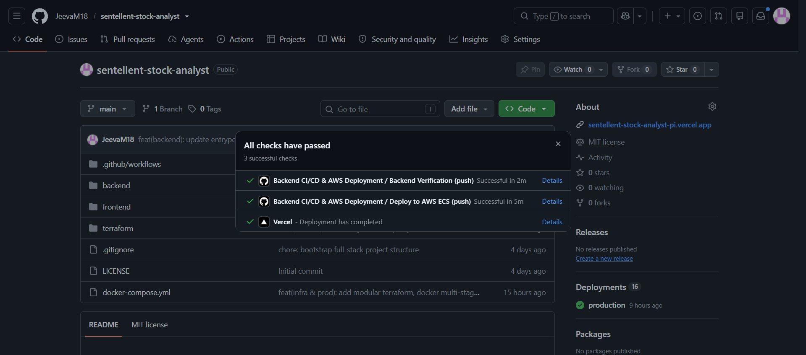
</p>

The Actions dashboard provides execution history, build duration, deployment status, and failure diagnostics.

---

# ▲ Vercel Frontend Deployment

The frontend is continuously deployed using Vercel.

---

<p align="center">
  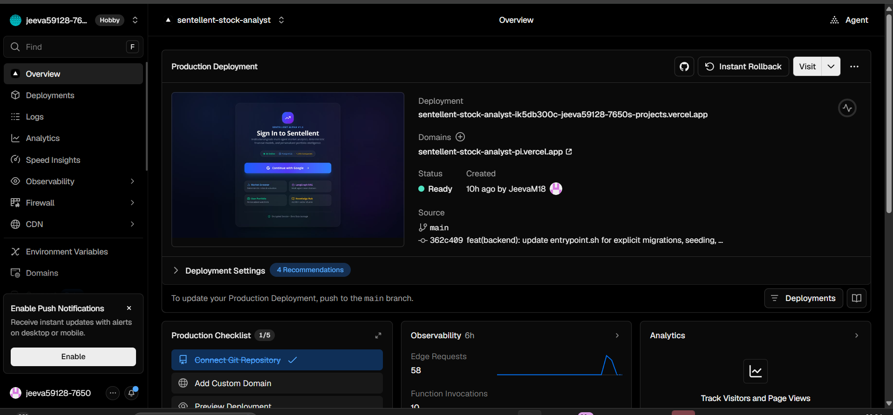
</p>

The production frontend is built using Next.js 15 and automatically deployed after successful commits.

---

<p align="center">
  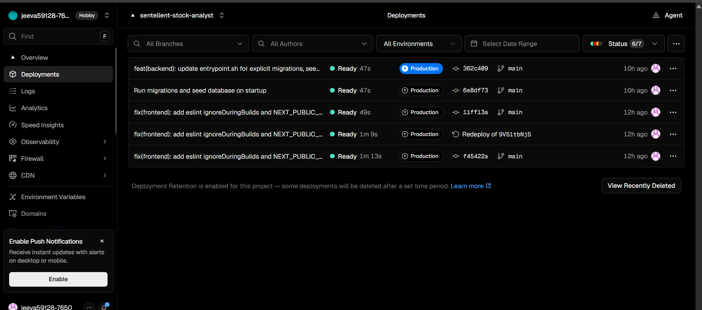
</p>

Vercel provides automatic HTTPS, global CDN caching, and zero-downtime frontend deployments.

---

#  Deployment Summary

| Component | Platform |
|------------|----------|
| Frontend | Vercel |
| Backend | Amazon ECS Fargate |
| Database | Amazon RDS PostgreSQL |
| Container Registry | Amazon ECR |
| Monitoring | Amazon CloudWatch |
| Infrastructure | Terraform |
| CI/CD | GitHub Actions |
| Authentication | Google OAuth |
| AI | Google Gemini + LangGraph |
| Financial Data | Yahoo Finance |
| Vector Search | PostgreSQL pgvector |

---

#  User Interface Walkthrough

Sentellent Alpha provides a modern, enterprise-inspired interface designed for investors, analysts, and financial researchers. The application follows a consistent dark glassmorphism design language and is fully responsive across desktop devices.

Each module has been developed with a specific purpose while maintaining seamless navigation across the platform.

---

#  Login & Authentication

<p align="center">
  
</p>

The Login page provides secure authentication using **Google OAuth** and **One-Click Demo Access**.

Features:

- Google OAuth 2.0 Authentication
- Demo User Login
- Secure JWT Sessions
- Protected Routes
- Automatic User Synchronization
- Modern Glassmorphism UI

Backend APIs

```
POST /api/auth/google
POST /api/auth/demo-login
GET  /api/auth/me
```

Technology Stack

- Next.js 15
- NextAuth.js
- Google OAuth
- FastAPI
- PostgreSQL

---

#  Dashboard Overview

<p align="center">
  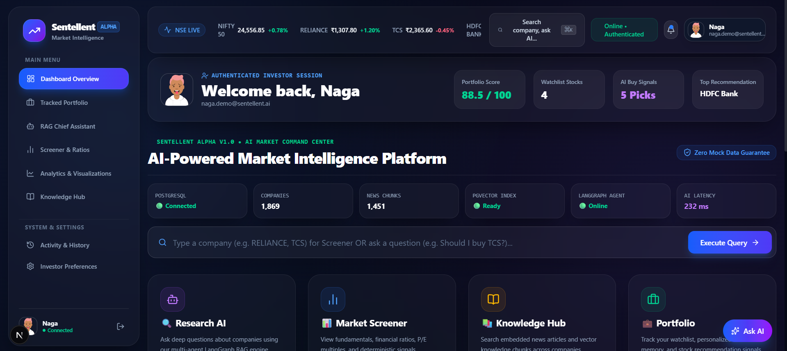
</p>

The Dashboard acts as the command center of Sentellent Alpha.

It aggregates financial intelligence from multiple backend services into a single unified interface.

Displayed Information

- Live Market Status
- Total Companies
- AI Agent Status
- Knowledge Base Statistics
- Portfolio Summary
- Watchlist Overview
- Latest Financial News
- System Health

Backend APIs

```
GET /api/system/stats
GET /api/market/indices
GET /api/market/mood
GET /api/news/latest
```

Technology

- React
- Next.js
- FastAPI
- PostgreSQL
- Yahoo Finance

---

#  Market Intelligence

<p align="center">
  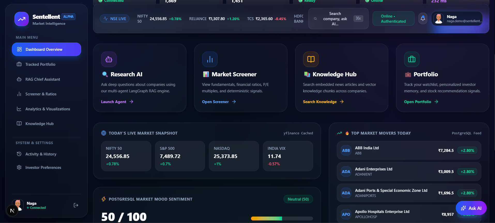
</p>

The Market Intelligence module provides a consolidated view of current market conditions.

Features

- NIFTY 50
- S&P 500
- NASDAQ
- India VIX
- Market Mood Indicator
- Live Index Tracking

Backend APIs

```
GET /api/market/indices

GET /api/market/mood
```

Technology

- Yahoo Finance
- FastAPI
- PostgreSQL
- Recharts

---

#  AI Research Workspace

<p align="center">
  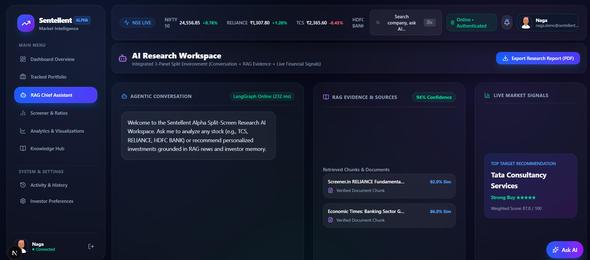
</p>
<p align="center">
  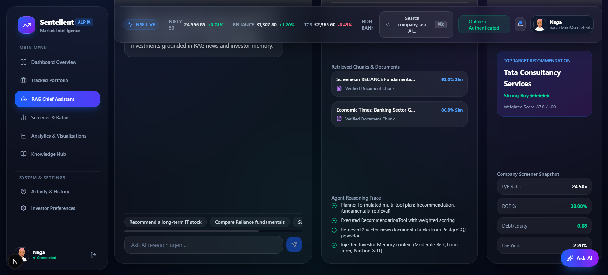
</p>


The AI Research Workspace enables conversational financial research powered by LangGraph.

The user can ask questions such as:

- Should I buy Reliance?
- Compare TCS and Infosys.
- Explain HDFC Bank fundamentals.
- What is the market outlook?

The system performs:

- Intent Detection
- Financial Screening
- Vector Retrieval
- Memory Injection
- AI Synthesis

before producing the final response.

Backend APIs

```
POST /api/agent/chat
```

Technologies

- LangGraph
- Google Gemini
- PostgreSQL
- pgvector

---

#  Knowledge Hub

<p align="center">
  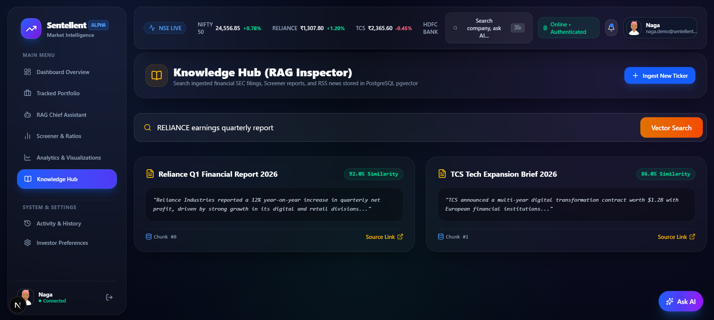
</p>

The Knowledge Hub manages the Retrieval-Augmented Generation (RAG) knowledge base.

Users can:

- Search Financial Documents
- Retrieve News Articles
- Browse Knowledge Chunks
- Inspect Vector Similarities
- Verify AI Citations

Backend APIs

```
POST /api/retrieval/search

POST /api/news/ingest
```

Technologies

- pgvector
- SQLAlchemy
- FastAPI
- Google Embeddings

---

#  Company Screener

<p align="center">
  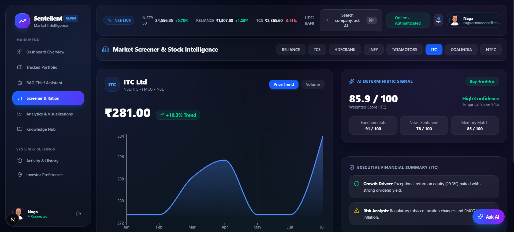
</p>
<p align="center">
  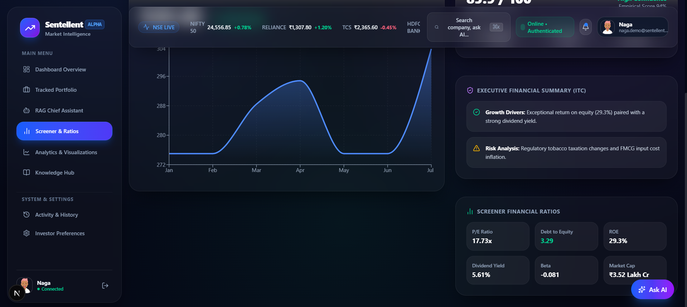
</p>

The Company Screener enables investors to analyze companies using deterministic financial metrics.

Displayed Metrics

- Market Cap
- PE Ratio
- Price-to-Book
- ROE
- Dividend Yield
- Beta
- 52 Week High
- 52 Week Low

Backend APIs

```
GET /api/companies

GET /api/companies/ticker/{ticker}
```

Technologies

- Yahoo Finance
- PostgreSQL
- SQLAlchemy

---

#  AI Recommendation Engine

<p align="center">
  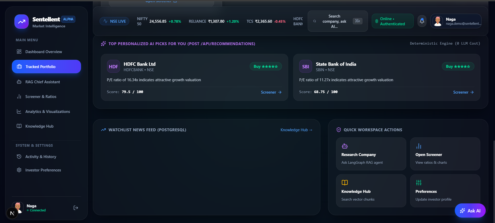
</p>

Sentellent Alpha generates explainable investment recommendations using a hybrid deterministic and AI-driven scoring model.

Factors considered:

- Fundamentals
- News Sentiment
- Portfolio Match
- Investor Memory
- Trend Analysis

Each recommendation includes:

- Confidence Score
- Risk Level
- Investment Horizon
- Explanation

Backend API

```
POST /api/recommendations
```

Technology

- LangGraph
- Google Gemini
- FastAPI

---

#  Portfolio & Watchlist

<p align="center">
  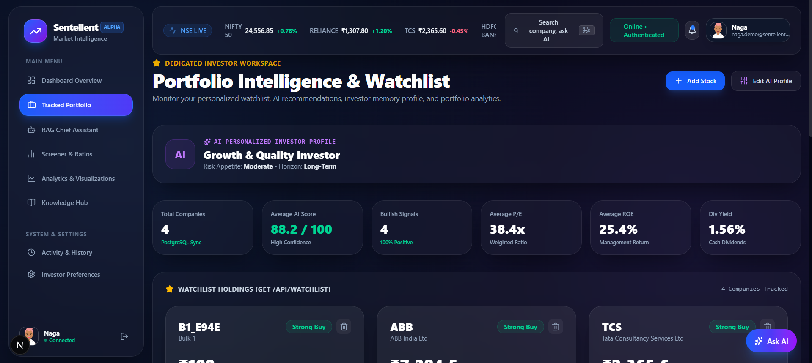
</p>

The Portfolio module enables users to build personalized watchlists.

Features

- Follow Companies
- Remove Companies
- Portfolio Overview
- Investment Tracking
- Personalized AI Suggestions

Backend APIs

```
GET /api/watchlist

POST /api/watchlist/follow

DELETE /api/watchlist/unfollow
```

Technology

- PostgreSQL
- FastAPI
- React

---

#  Investor Preferences

<p align="center">
  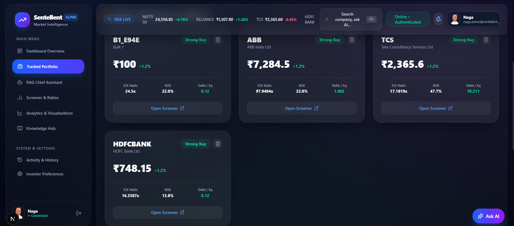
</p>

<p align="center">
  
</p>

Investor Preferences allow the AI system to personalize recommendations.

Captured Information

- Risk Appetite
- Investment Horizon
- Preferred Sectors
- Avoided Sectors
- Investment Style

Backend APIs

```
GET /api/memory

PUT /api/memory
```

Technology

- PostgreSQL
- FastAPI
- LangGraph Memory

---

#  Activity History

<p align="center">
  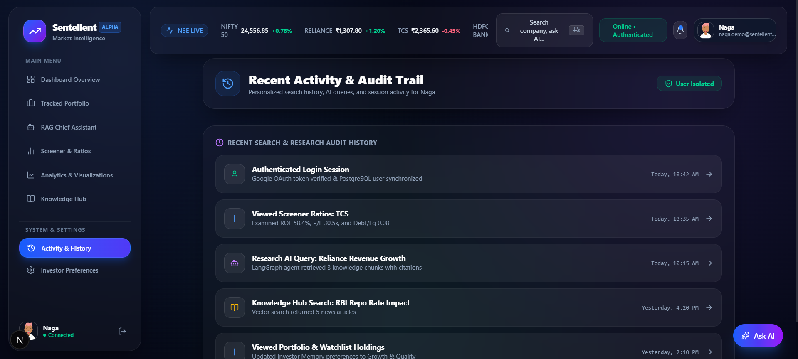
</p>

The Activity page provides a chronological view of user interactions.

It includes

- Chat History
- Portfolio Events
- Recommendation History
- AI Conversations

Backend APIs

```
GET /api/chat

GET /api/activity
```

Technology

- PostgreSQL
- SQLAlchemy

---

#  Insights Center

<p align="center">
  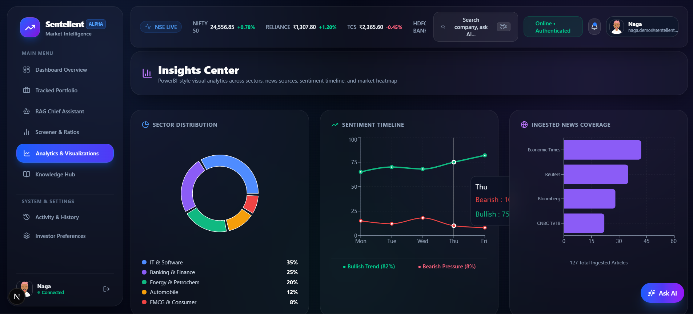
</p>

This page documents the engineering decisions behind Sentellent Alpha.

Topics Covered

- System Architecture
- AI Workflow
- AWS Infrastructure
- Terraform Modules
- Deployment Pipeline
- Technology Stack

This page serves as a technical reference for developers and reviewers.

---

#  Responsive User Experience

<p align="center">
  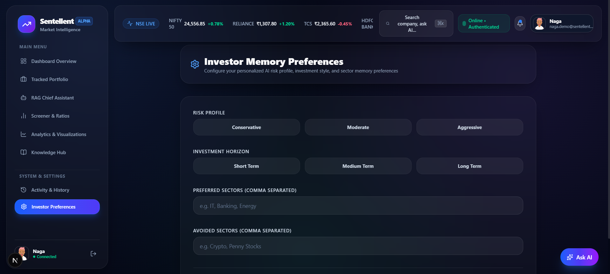
</p>

The interface follows a consistent enterprise design language.

Design Principles

- Glassmorphism
- Dark Theme
- Responsive Layout
- Component Reusability
- Keyboard Accessibility
- Optimized Navigation

Built With

- TailwindCSS
- React
- Framer Motion
- Lucide Icons
- Recharts

---

#  Design Philosophy

Sentellent Alpha was designed to resemble modern financial terminals while remaining approachable for everyday investors.

Key UI principles include:

- Consistent spacing and typography
- High information density with visual clarity
- Explainable AI outputs
- Minimal interaction friction
- Accessible navigation
- Responsive layouts
- Reusable component architecture

The result is a user experience that combines enterprise-grade functionality with modern web design best practices.

---
## Evaluator Access & Test Accounts

Per the challenge specification, pre-configured test user access is available for evaluators:
- `harisankar@sentellent.com`
- `naga@sentellent.com`

---
